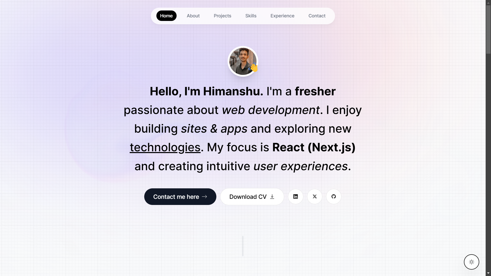

# Portfolio Website 🚀

This is a personal portfolio website built with **Next.js** and **Tailwind CSS**, designed to showcase my skills, projects, and experience as a software developer. It features a clean, responsive design with interactive sections.

## Features ✨

- **Responsive Design:** Works on all screen sizes 📱💻
- **Dark Mode Toggle:** User preference-based dark mode 🌙
- **Animated Sections:** Smooth animations for better user experience 🎨
- **Contact Form:** Integrated email service for inquiries 📧
- **Skills Section:** Highlights technical expertise 💻
- **Experience Section:** Timeline-style career overview 🗓️
- **Projects Section:** Showcases key development projects 🚧
- **Fluid Cursor Background:** Interactive background that follows cursor movement 🖱️💫

---

## Tech Stack 🛠️

### **Frontend:**
- [Next.js](https://nextjs.org/) - React framework for production ⚛️
- [React](https://reactjs.org/) - Library for building UI 🔧
- [TypeScript](https://www.typescriptlang.org/) - Type-safe JavaScript 📝
- [Tailwind CSS](https://tailwindcss.com/) - Utility-first CSS framework 🎨

### **Backend/Email Handling:**
- [Sonner](https://sonner.dev/) - Email handling service 📬
- [Resend](https://resend.dev/) - Email service integration 📤

### **Other Libraries:**
- [React-Vertical-Timeline-Component](https://www.npmjs.com/package/react-vertical-timeline-component) - Timeline visualization for the experience section 🗂️
- [React-Intersection-Observer](https://www.npmjs.com/package/react-intersection-observer) - Intersection observer for triggering animations 👁️
- [React-Icons](https://react-icons.github.io/react-icons/) - Icons for the UI 🎨
- [Motion](https://www.npmjs.com/package/motion) - Animation library for smooth transitions 🌀

### **Development Tools:**
- Version Control: Git & GitHub 🧰
- Package Manager: npm 📦
- Code Editor: VSCode 🖥️
- Deployment: Vercel (or any preferred platform) 🌐

---

## Setup ⚙️

1. **Clone the Repository:**
   ```bash
   git clone https://github.com/yourusername/portfolio-website.git
   cd portfolio-website
   ```

2. **Install Dependencies:**
   ```bash
   npm install
   ```

3. **Configure Environment Variables:**
   Create a `.env.local` file in the root directory and add the following:
   ```env
   RESEND_API_KEY=your_resend_api_key
   ```

4. **Run the Development Server:**
   ```bash
   npm run dev
   ```

5. **Access the Website:**
   Open [http://localhost:3000](http://localhost:3000) in your web browser. 🌐

---

## Deployment 🚀

1. **Build the Project:**
   ```bash
   npm run build
   ```

2. **Start the Production Server:**
   ```bash
   npm start
   ```

3. **Deploy to Vercel:**
   Use the Vercel CLI or directly deploy from the GitHub repository.

---

## Contributing 🤝

Contributions are welcome! If you have suggestions or improvements, feel free to open a pull request.

---

## License 📄

This project is licensed under the MIT License. See the [LICENSE](LICENSE) file for more details.

---

Happy Coding! 💻🎉

